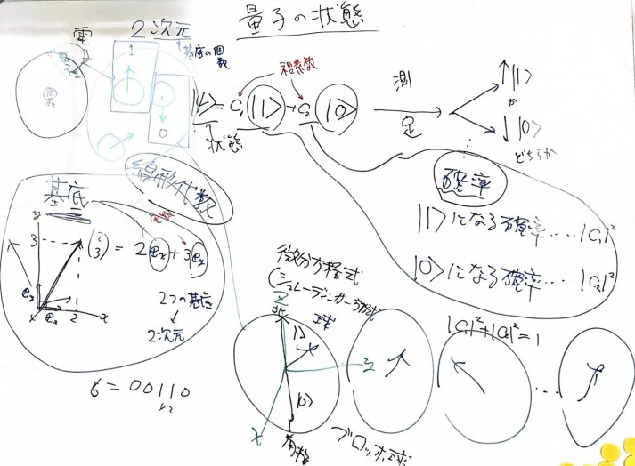
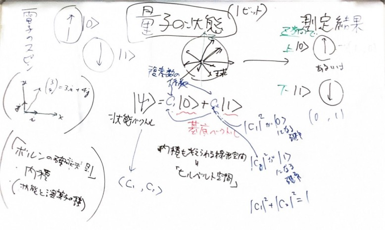
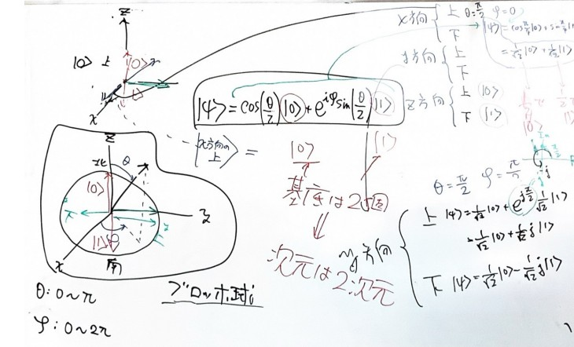
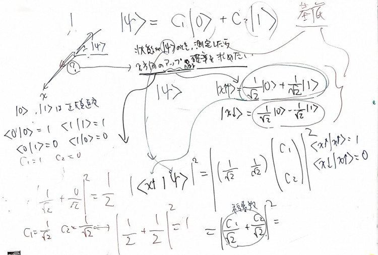
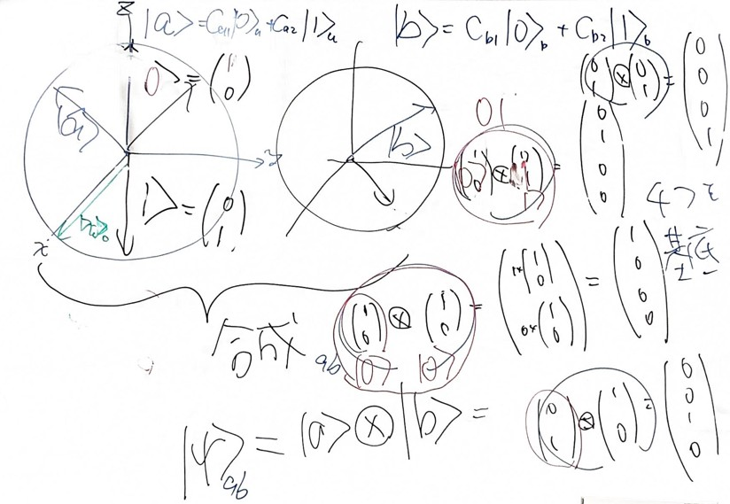
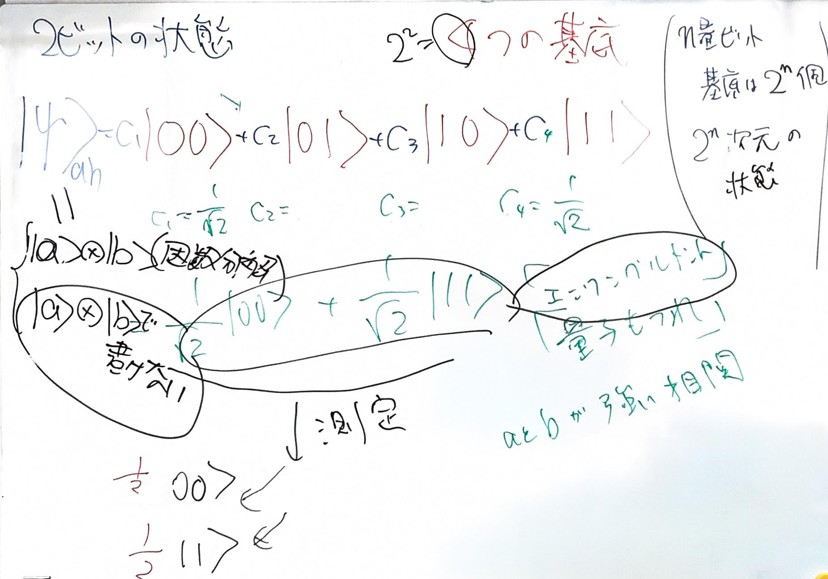

# 量子論ゼミ

量子ビットの重ね合わせ．基底の線形結合．係数と測定したときの確率の関係

複素係数のベクトル空間．内積が確率を表す．

ブロッホ球による状態ベクトルの表現．z方向の基底によるx方向の基底の表現．

正規直交基底．内積による確率の計算

2つのビットの合成系．直積から得られる4つの基底．

4つの基底によって作られる空間．そこに含まれるエンタングルされた2粒子．積状態とエンタングル状態．