# 量子論ゼミ

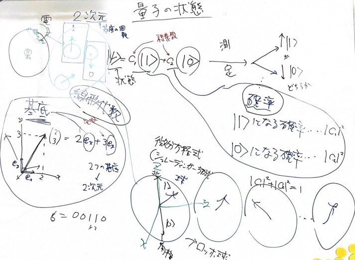

量子ビットの重ね合わせ．基底の線形結合．係数と測定したときの確率の関係

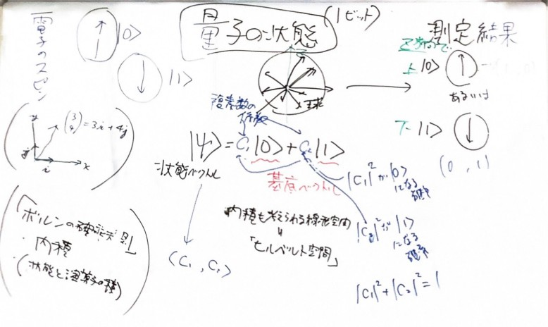

複素係数のベクトル空間．内積が確率を表す．

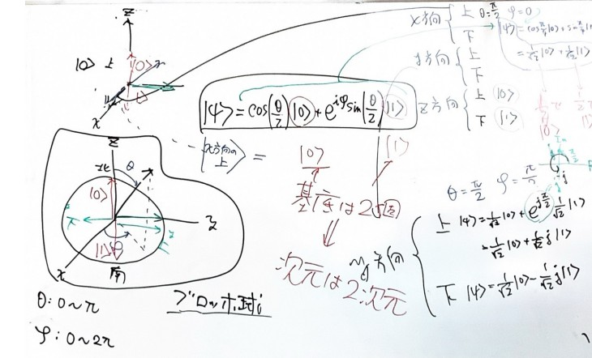

ブロッホ球による状態ベクトルの表現．z方向の基底によるx方向の基底の表現．

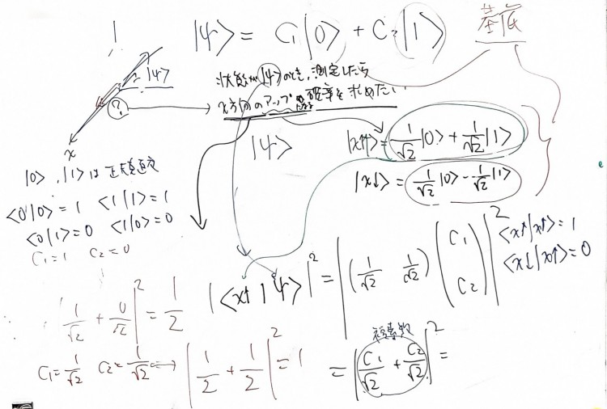

正規直交基底．内積による確率の計算

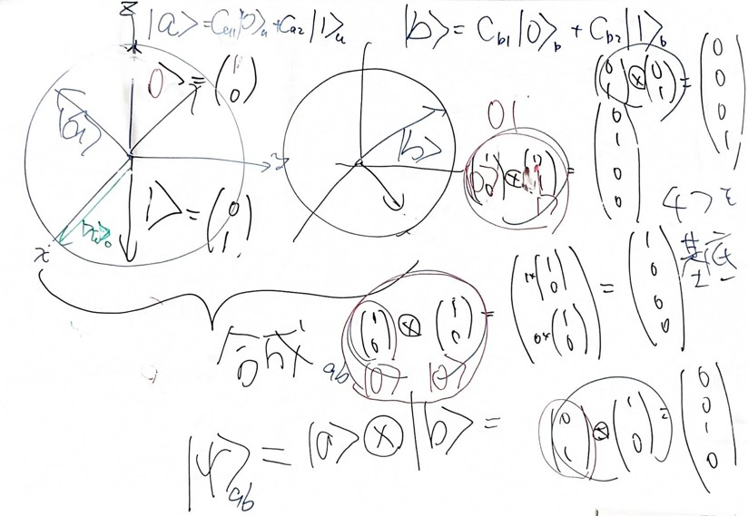

2つのビットの合成系．直積から得られる4つの基底．

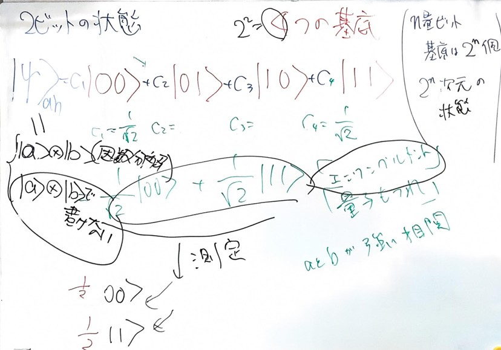

4つの基底によって作られる空間．そこに含まれるエンタングルされた2粒子．積状態とエンタングル状態．

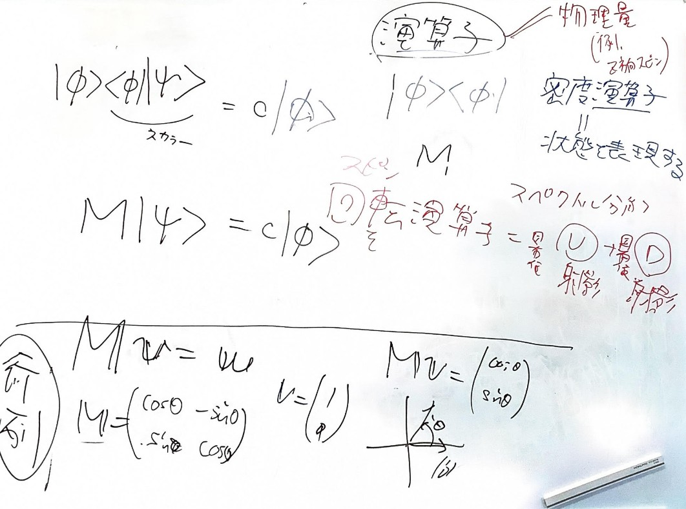

演算子

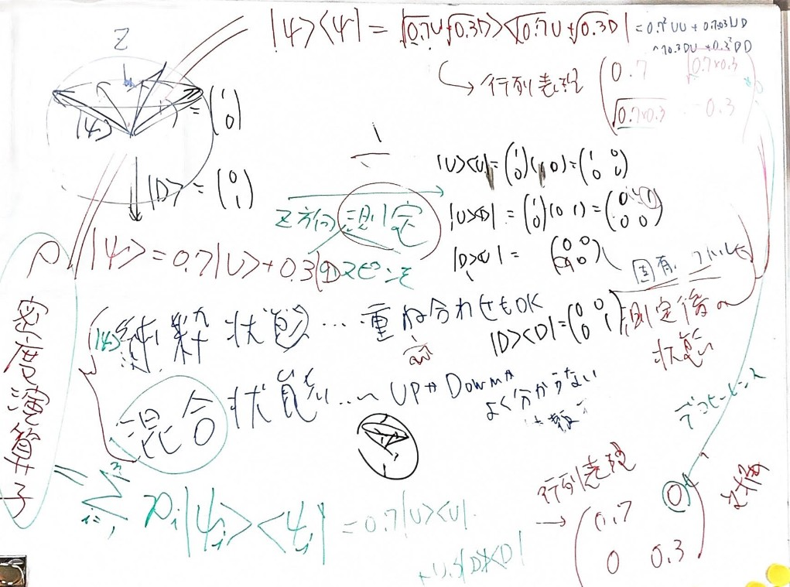

密度演算子，純粋状態と混合状態

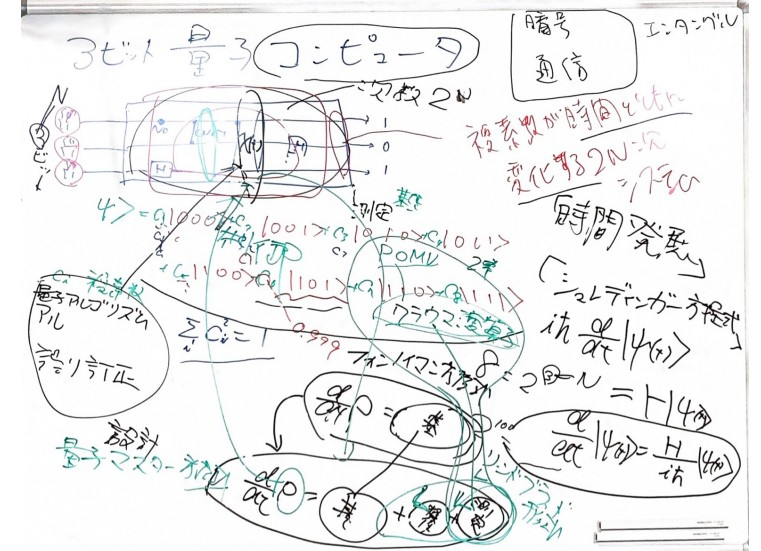

量子コンピュータ，内部状態，シュレーディンガー方程式，
フォンノイマン方程式，リンドブラッド形式

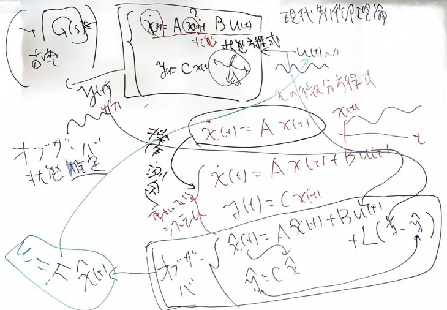

現代制御理論のオブザーバとフィードバック制御

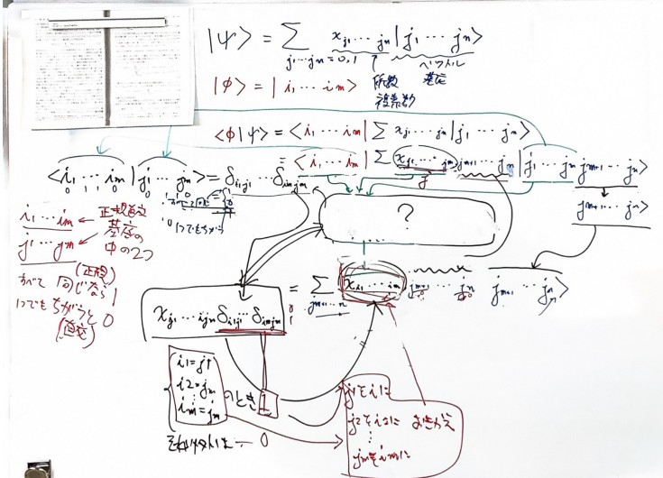

部分系の内積

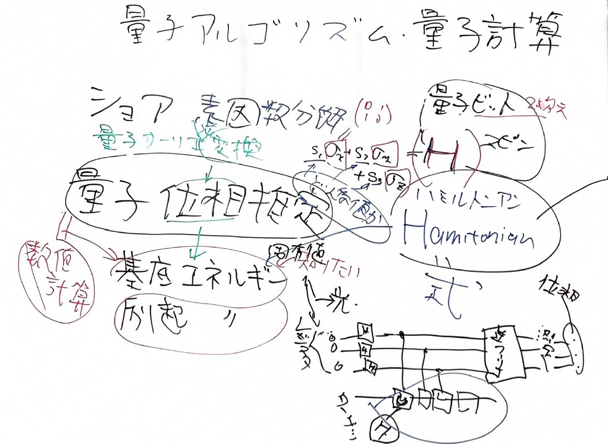

量子位相推定

量子測定理論

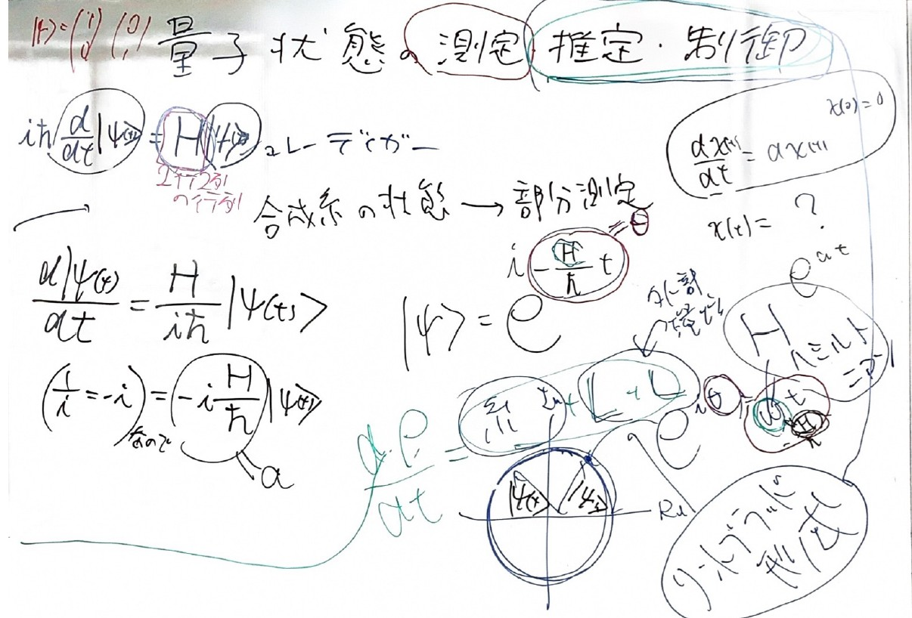

量子状態の推定と制御